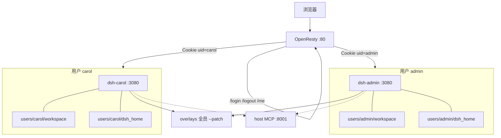

# dsh-docker-mutil-user

`dsh web` 一次只服务一个用户。本仓库用 OpenResty 做唯一入口：登录后发 `dsh_gw` Cookie，再按 uid 反代到该用户自己的工作容器。每个用户独占一个容器、一份 `$DSH_HOME` 和一份 workspace，互不影响。

工作容器的端口不对外发布，对外端口只有Openresty（默认80，可通过环境变量修改）。公网部署请走 TLS，并设 `COOKIE_SECURE=1`。账号密码在 `openresty/users.lua`，启动时读进内存。

## 架构



| 路径 | 行为 |
| --- | --- |
| `/login` `/logout` `/me` | 网关自己处理登录、清 Cookie、返回当前 uid |
| `/workspace/` | 该用户 workspace 的目录索引（只读 GET/HEAD，不含 `dsh_home`） |
| 其余 | 反代到 `dsh-<uid>:3080` |
| `/manifest.webmanifest` | 浏览器拉 manifest 不带 Cookie，免登录落到字典序最小的已配置用户 |

`scripts/render-compose.sh` 读 `users.lua`，写出 `docker-compose.users.yml`（不要手改）。改密码后 `docker compose exec openresty openresty -s reload` 即可；增删用户必须重新渲染再启动。

## Overlays

每个用户容器挂同一份 `overlays/`，启动时 `--patch` 进去。`.cordis.yml` 负责插入，`*-plugin/` 里是实现。带 `name` 的 overlay `package.json` 必须同时写 `version`，否则 DeepSeek 官方请求在组 `dsh_plugin_packages` 时会以 `REQUEST_EXTENSION` 失败。

| Overlay | 作用 |
| --- | --- |
| `lan-bind.cordis.yml` + `openresty-proxy-auth-plugin` | 容器内听 `0.0.0.0:3080`，关掉 cookie / Host / Origin 校验，只信网关 |
| `shared-mcp.yml` | 所有用户接同一份外部 Streamable HTTP MCP（默认 `mcp__echo__echo`） |
| `whoami.cordis.yml` | 侧栏「设置」下方显示登录用户，确认后请求 `GET /logout` |
| `suppress-welcome.cordis.yml` | 新建空白会话不再弹出「内测声明」 |
| `hide-settings-sections.cordis.yml` | 设置弹框只留「通用」，去掉模型 / 插件 / Agent 预设 |
| `hide-feedback.cordis.yml` | 去掉消息上的「好的回答 / 有问题的回答」和斜杠「添加」里的反馈指令 |
| `default-workspace.cordis.yml` | 启动时把 `/workspace` 登记为工作区；同一路径重复登记会复用 |
| `default-flat-list.cordis.yml` | 浏览器还没有分组偏好时，侧栏默认「单列表」 |
| `default-full-access.cordis.yml` | 新会话默认「完全权限」；关掉输入框下拉、设置「通用」权限行和斜杠「指令」里的 `/permission` |
| `slash-skill-first.cordis.yml` | 输入框 `/` 菜单里「技能」排到「添加」「指令」前面 |
| `workspace-html-preview.cordis.yml` | 侧栏预览 HTML 时 iframe 打开网关上的 `/workspace/`，相对资源能加载 |

共享 MCP 不在本仓库启动。先在旁路的 `mcp-echo` 目录 `docker compose up --build -d`，用户容器经 `host.docker.internal:8001` 访问。新增共享 MCP 时改 `overlays/shared-mcp.yml` 并重启对应用户容器。

## 启动

```sh
cp .env.example .env
docker compose up --build
```

当前演示账号：`admin` / `admin`。

## 增加用户

在 `openresty/users.lua` 加一行：

```lua
return {
  admin = 'admin',
  carol = 'plain-password',
}
```

然后：

```sh
bash scripts/render-compose.sh
docker compose up --build -d
```
